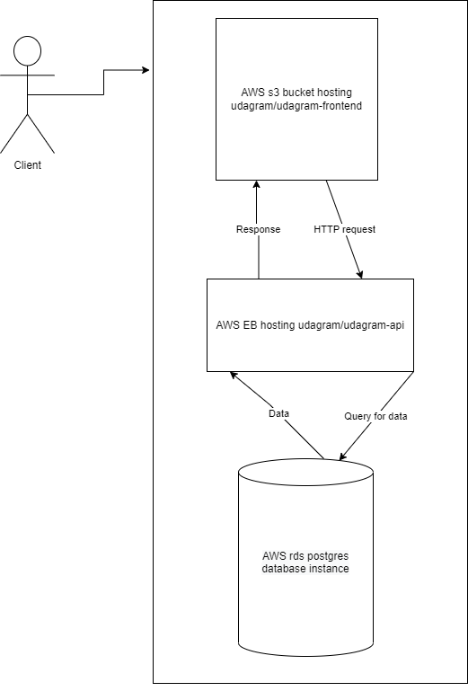

# Hosting a Full-Stack Application

App link: http://udagram-1.s3-website-us-east-1.amazonaws.com/home
---

## App infrastructer

## Pipeline

### Installation

1. Create an awa RDS database service.
1. Create an aws s3 bucket to upload the files.
1. Write your ENV variables needed for this project.
1. Run `npm run api:install` to start installation, then run `npm run api:start` to start the dev server.
1. Run `npm run frontend:install` to start installation, then run `npm run frontend:start` to open the website.

## Testing

It contains 2 different test suites: unit tests and End-To-End tests:

1. `cd starter/udagram-frontend`
1. `npm run test`
1. `npm run e2e`

There are no Unit test on the back-end

#### Unit Tests:

Unit tests are using the Jasmine Framework.

#### End to End Tests:

The e2e tests are using Protractor and Jasmine.

## Built With

- [Node.JS](https://nodejs.org)
- [Angular JS](https://angular.io/)
- [Express JS](https://expressjs.com/)

## License

[License](LICENSE.txt)
